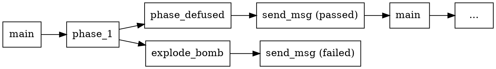
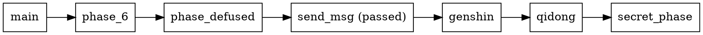

# VS Code 汇编插件


# 本地化

修改 `initialize_bomb()`：
```c
0x0000555555555e38 <+172>:   mov    $0x4,%edi
0x0000555555555e3d <+177>:   call   0x555555555310 <malloc@plt>
0x0000555555555e42 <+182>:   movl   $0x2023fa11,(%rax)
                             ret
```

搜索：f3 0f 1e fa 55 53 48 81 ec 00 10 00 00 48 83 0c 24 00

替换：c7 00 11 fa 23 20 c3


修改 `send_msg()`：

替换：c7 06 01 00 00 00 c3

修改 `explode_bomb()`：开头 c3

# gdb

直接打印数组和字符串

`gdb bomb -x cmds`：alias mmk='gdb -x cmds --args bomb pswd'

`quit`

`run`

删除断点：`clear`

`info reg`

`stepi`：单步执行汇编

`finish`：跳出当前函数，回到调用者函数

`disas`：dump disassembly

`print /x $rax`

`print /d $rax`

`print (char*) addr`

`print *(int*) addr`

`backtrace` `bt`：print stack

`advance 停止处`：继续，直到停止处

print (char*) $rip+0x247b

# phase_1


# phase_2

```c
void read_six_numbers(char*, int*);

void phase_2(char* input) {
    // <+0> 到 <+23>: 分配栈空间, 设置 canary value
    int num[6];    // 存在 (rsp)
    read_six_numbers(input, num);

    if (num[0] != 1) explode_bomb();

    int ebx;    // <+39>
    for (ebx = 1; ebx <= 5; ++ebx) {
        // <+66> 到 <+84>
        if (num[ebx - 1] * 2 != num[ebx]) explode_bomb();
    }
    // <+86> 到末尾: 释放栈空间
    return;
}
```

# phase_3

```c
int* arr[7] = { /* ... */ }; 

void phase_3(char* input) {
    int a, b;
    int scanf_res = sscanf(input, "%d %d", &a, &b);
    if (scanf_res <= 1) explode_bomb();
    if (a > 7) explode_bomb();

    goto *(arr + arr[a]);
    // 跳转的目标还在函数 phase_3 内部, 由一个 mov 指令
    // 和一个 jmp 指令组成, 相当于一个跳转表:

    // switch (a) {
    //      case 0: if (b != some_num) explode_bomb();
    //              break;
    //      case 1: ...
    // }
}
```

# phase_4

```c
phase_4 {
    int a, b;
    int scanf_res = sscanf(input, "%d %d", &a, &b);
    if (scanf_res != 2) explode_bomb();
    if (a < 0 || a > 14) explode_bomb();
    if (func4(a, 0, 14) != 0x23) explode_bomb();
    if (b != 0x23) explode_bomb();
    // 答案: a=8, b=35
}   

int func4(int x, int y, int z) {
    int t = z - y;
    t = (SHR(t, 31) + t) >> 1;
    t += y;

    // 当 z > y 时, SHR(t, 31) == 0, 于是
    //    t = (z - y) / 2 + y = (z + y) / 2

    // 观察不难发现, 不可能出现 z < y 的情况
    if (t > x) 
        t += func4(x, y, t - 1);
    else if (t < x) 
        t += func4(x, t + 1, z);
    return t;
}

void tellMeAns() {
    for (int i = 0; i != 15) {
        if (func4(i, 0, 14) == 0x23) 
            printf("%d\n", i);
    }
}
```

# phase_5

```c
phase_5 {
    int a, b;
    scanf("%d %d", &a, &b);
    a &= 0xf;

    int d = 0;    // edx
    int c = 0;    // ecx

    while (a != 15) {
        ++d;
        a = arr[a];    // a == 0x555555558400
        // index:  0  1  2  3  4  5  6  7  8  9 10 11 12 13 14 15
        //   arr: 10 02 14 07 08 12 15 11 00 04 01 13 03 09 06 05

        // 6 14 2 1 10 0 8 4 9 13 11 7 3 12 5 
        c += a;
    }
    // c = 15+6+14+2+1+10+0+8+4+9+13+11+7+3+12 = 115
    if (d != 0xf) explode_bomb();     
    if (c != b) explode_bomb();
    return;
}
```

# phase_6

```c
void read_six_numbers(char* input, int num[6]);

phase_6(/* ... */) {
    int num[6];
    read_six_numbers(input, num);

    // 第一部分: 6 个数必须是 1~6 的排列
    int ebp;    // <+36>
    for (ebp = 0; ebp <= 5; /* <+82> */ ebp = r12d) {
        if (num[ebp] - 1 > 5) explode_bomb();

        r12d = ebp + 1;
        j = r12d;        // j: ebx
        for (j <= 5; j++) {   // <+58>
            if (nums[j] == nums[ebp]) explode_bomb();
        }
    }

    // 第二部分: num[i] = 7 - num[i]
    // <+110>
    for (int rax = 0; rax <= 5; ++rax) {
        num[rax] = 7 - num[rax];
    }

    // 第三部分
    // <+139>
    for (int esi = 0; esi <= 5; /* <+169> */ esi++) {
        int eax = 1;
        Node* rdx = node1;  // <+179>

        // 这个循环的意思是:
        // num[esi] 是多少, arr[esi] 就存 node多少
        while (num[esi] > eax /* <+153~159> */) {
            rdx = *(rdx + 8);  // rdx = rdx->next
            eax++;
        }
        // arr 是结点指针数组
        arr[esi] = rdx;    // arr stored in rsp+0x20
    }

    // 第四部分
    // <+188>
    // rbx = arr
    rcx = arr;    
    // 让 arr[0] 指向 arr[1], arr[1] 指向 arr[2], ...
    for (int eax = 1; eax <= 5 /* <+221> */; eax++) {
        // <+203>
        rdx = arr[eax]
        *(rcx + 8) = rdx;  // rcx->next = arr[eax]
        rcx = rdx;
    }
    *(rcx + 8) = 0;    // arr[5]->next = NULL

    // 第五部分
    int ebp = 0;  // <+234>
    rbx = arr;    // 在第四部分里
    // arr 里的指针指向的结点, 必须满足值从小到大的顺序
    for (; ebp <= 4; ebp++) {
        if (*rbx > *(rbx + 8))  // rbx->val > rbx->next->val
            explode_bomb();
        rbx = *(rbx + 8);    // rbx = rbx->next
    }

    // node    1    2   3   4   5   6
    //  val  559  710 177 617 735 104

    //  7-num[i]    631425
    //    num[i]    146352
}
```

# genshin qidong

```c
genshin {
    int a, b;
    char* str;
    sscanf("8 35 a b", "%d %d %s", &a, &b, str)
    if (str == "DoUKnowThatTheHarderThing2DoAnd...")
        return 1;
    return 0;
}

qidong {
    // 1 2 4 8 16 32
    char* rax = "1 2 4 8 16 32";  // which stored in input
    while (rax[0] != 0) {
        rax++;    
    }  // rax = rax + 13
    rax--;
     (rax[0] != ' ') {
        // *rdx 上存一个 0x0 字节
        while (rax != input) {
            rdx[0] = rax[0];
            rdx++;
            rax--;
            ecx = rax[0];
        }
    }
    return rsp == "?gnihTema3ehTyllausUerAoD2gnihTthgiRehT..."?  1 : 0;
    // ...TheRightThing2DoAreUsuallyThe3ameThing?
}
```

# secret_phase

```c
secret_phase {
    str = read_line();  // str in rbp
    // str.length() <= 13
    for (i = 0; str[i] != '\0'; i++) { // i in ebx
        if (i <= 12) continue;
        else explode_bomb();
    }
    if (check_sync(str)) explode_bomb();
}

check_sync(char* str) {
    r12 = emulate_fsm(0, str);
    for (int i = 1; i <= 6; i++) {  // i in ebx
        if (emulate_fsm(i, str) != r12) {
            return 0xffffffff;
        };
    }
    return 0;
}

emulate_fsm(int n, char* str) {
    // n in rbp, str in rbx
    while (str[i] != '\0') {
        if (str[i] <= '1') {
            int t = (str[i] - 0x30);
            t = 7 * t + n;
            n = tab[t];
            // case 0: n = tab[n]; 
            // case 1: n = tab[7 + n];
            ++i;
        } else explode_bomb();
        // index            0 1 2 3 4 5 6 7 8 9 10 11 12 13
        // tab[index]       0 5 1 2 6 4 3 2 3 4  1  0  0  0

        // n.old            0 1 2 3 4 5 6
        // n when str[i]=0  0 5 1 2 6 4 3
        // n when str[i]=1  2 3 4 1 0 0 0
    }
    return n;
}
```


# phase_1 collection

No great mind has ever existed without a touch of madness.

Good times never last. Time to say bye. BOOM.

Do not go gentle into that good night. Rage, rage against the dying of the light.

# main arch




